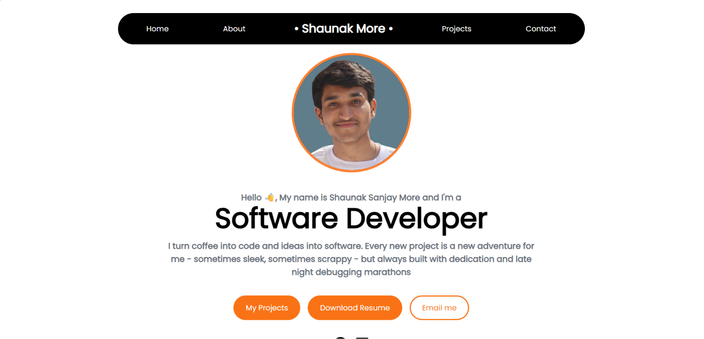

# Shaunak More - Portfolio Website



## 📋 Overview

A responsive personal portfolio website built with React and Tailwind CSS. This portfolio showcases my projects, skills, and achievements while providing visitors with an easy way to learn about me and get in touch.

## ✨ Features

- **Responsive Design**: Optimized for all devices from mobile to desktop
- **Smooth Scrolling**: Navigate between sections with smooth scrolling animations
- **Interactive UI**: Fade-in animations on scroll for better user experience
- **Contact Form**: Built-in contact form with email integration via EmailJS
- **Timeline Component**: Visual representation of key achievements
- **Mobile-friendly Navigation**: Hamburger menu for smaller screens

## 🛠️ Tech Stack

- **React**: Frontend library for building user interfaces
- **Tailwind CSS**: Utility-first CSS framework for rapid styling
- **React-Scroll**: For smooth scrolling navigation
- **EmailJS**: For handling contact form submissions
- **React Icons**: For UI icons
- **React Hot Toast**: For user notifications

## 🚀 Getting Started

### Prerequisites

- Node.js (v14.0.0 or later)
- npm (v6.0.0 or later)

### Installation

1. Clone the repository
   ```bash
   git clone https://github.com/ShaunakMore/portfolio-website.git
   cd portfolio-website
   ```

2. Install dependencies
   ```bash
   npm install
   ```

3. Start the development server
   ```bash
   npm run dev
   ```

4. Open your browser and navigate to `http://localhost:5173`

## 📦 Building for Production

```bash
npm run build
```

This will create a `dist` folder with all the production-ready files.

## 🌐 Deployment

This portfolio is configured for easy deployment on Vercel:

1. Create an account on [Vercel](https://vercel.com/)
2. Connect your GitHub repository
3. Deploy with default settings

## 🧩 Project Structure

```
portfolio-website/
├── public/               # Public assets and resume
├── src/
│   ├── assets/           # Images and static resources
│   ├── components/       # React components
│   │   ├── ContactForm.jsx
│   │   ├── FadeInSection.jsx
│   │   ├── SocialLinks.jsx
│   │   └── TimelineComponent.jsx
│   ├── App.css           # Main stylesheet
│   ├── App.jsx           # Main application component
│   ├── index.css         # Global styles and Tailwind imports
│   └── main.jsx          # Entry point
└── package.json          # Dependencies and scripts
```

## 🎨 Customization

### Changing Colors

The primary color scheme uses orange (`#FF8132`) as the accent color. You can modify this in the Tailwind classes and App.css file.

### Adding New Projects

Edit the Projects section in `App.jsx` to add your own projects, following the existing structure.

### Updating Timeline Events

Modify the `timelineData` array in `TimelineComponent.jsx` to showcase your own achievements and events.

## 📱 Responsive Breakpoints

- **Mobile**: Up to 640px
- **Tablet**: 641px to 1024px
- **Desktop**: 1025px and above

## 📬 Contact Form Setup

The contact form uses EmailJS for sending emails. To configure it for your own use:

1. Create an account at [EmailJS](https://www.emailjs.com/)
2. Create a service and email template
3. Update the service ID, template ID, and user ID in `ContactForm.jsx`

## 🔗 Links

- [GitHub](https://github.com/ShaunakMore)
- [LinkedIn](https://linkedin.com/in/shaunak-more-37171a285)

## 📄 License

This project is open source and available under the [MIT License](LICENSE).

---

Created with ☕ by Shaunak More